# Neura E2E Automation Framework

This repository contains an automated end-to-end testing framework for the Neura Bridge UI, built using Playwright. The framework allows for comprehensive testing of the Neura Bridge application, including wallet integration, network switching, and token bridging operations.

## Features

- End-to-end UI testing for Neura Bridge application
- MetaMask wallet integration
- Network switching between Sepolia and Neura Testnet
- Token bridging verification
- Page layout validation
- Transaction verification on blockchain

## Prerequisites

- Node.js (v18 or higher)
- npm (v8 or higher)
- Chrome browser
- MetaMask extension

## Installation

1. Clone the repository:
   ```bash
   git clone https://github.com/neura-labs/neura-e2e-automation.git
   cd neura-e2e-automation
   ```

2. Install dependencies:
   ```bash
   npm install
   ```

## Configuration

1. Create a `.env` file in the root directory with the following variables:
   ```
   SEED_PHRASE=your_wallet_seed_phrase
   WALLET_PASSWORD=your_wallet_password
   NEURA_NET_URL=https://url-to-neura-bridge-app
   SEPOLIA_RPC_URL=https://sepolia-rpc-url
   NEURA_RPC_URL=https://neura-testnet-rpc-url
   ```

## Running Tests

Run all tests:
```bash
npm test
```

Run a specific test:
```bash
npx playwright test tests/neura-bridge-layout.spec.js
```

Run tests with UI mode:
```bash
npx playwright test --ui
```

View the HTML report:
```bash
npm run report
```

Format code:
```bash
npm run format
```

## Architecture

The Neura E2E Automation Framework follows a modular, layered architecture designed for maintainability, reusability, and extensibility. The framework employs several design patterns to achieve a clean separation of concerns and promote code reuse.

### Design Principles

- **Separation of Concerns**: Each component has a single responsibility, making the codebase easier to maintain and extend.
- **Abstraction**: Implementation details are hidden behind interfaces, allowing for flexibility in implementation.
- **Modularity**: Components are designed to be self-contained and reusable across the framework.
- **Encapsulation**: Playwright functionality is wrapped in custom classes to provide a consistent interface and hide implementation details.
- **Avoiding Hard-coded Values**: All strings and values are extracted into constants or enums to ensure maintainability and consistency.
- **Organized Assertions**: Custom assertion methods are placed in dedicated utility classes to improve reusability and clarity.

### Design Patterns

The framework implements several design patterns:

1. **Page Object Model (POM)**: UI interactions are encapsulated in page objects, separating test logic from UI implementation details.
   - `BasePage`: Provides common functionality for all page objects
   - `WalletPage`: Extends BasePage with wallet-specific functionality
   - Specific page implementations (e.g., `BridgePage`, `SwapPage`, `FaucetPage`, `MetamaskPage`)

2. **Factory Pattern**: Used to create instances of complex objects with a common interface.
   - `PlaywrightFactory`: Creates and caches PlaywrightWrapper instances
   - `WalletFactory`: Creates wallet instances based on wallet type

3. **Template Method Pattern**: Defines the skeleton of an algorithm in a method, deferring some steps to subclasses.
   - `WalletPage.importWallet()`: Defines the wallet import workflow, with specific steps implemented by subclasses

4. **Strategy Pattern**: Allows selecting an algorithm's implementation at runtime.
   - Used in `BridgePage.setWallet()` to configure different wallet implementations

### Component Interactions

- **Test Layer**: Test files use fixtures to set up the testing environment and interact with page objects.
- **Fixture Layer**: Provides reusable setup and teardown logic for tests, including browser initialization and wallet setup.
- **Page Object Layer**: Encapsulates UI interactions and provides a high-level API for tests.
- **Core Layer**: Provides reusable "engine" code, including Playwright wrappers and wallet factories.
- **Utility Layer**: Provides helper functions and utilities used across the framework.

#### Core Components Communication Diagram

The following diagram illustrates the communication between the core PlaywrightFactory, PlaywrightWrapper, BasePage, and dedicated Pages that extend BasePage:

```mermaid
graph LR
    Test[Test Files] -.->|optionally uses| Fixture[Test Fixtures]
    Test -->|uses| Page[Dedicated Page Objects]
    Fixture -->|creates| Page
    Page -->|extends| BasePage[BasePage]
    BasePage -->|uses| PlaywrightFactory[PlaywrightFactory]
    PlaywrightFactory -->|creates/caches| PlaywrightWrapper[PlaywrightWrapper]
    Page -->|inherits & uses| PlaywrightWrapper
    PlaywrightWrapper -->|interacts with| Browser[Browser/DOM]

    classDef core fill:#f9f,stroke:#333,stroke-width:2px;
    classDef page fill:#bbf,stroke:#333,stroke-width:2px;
    classDef test fill:#bfb,stroke:#333,stroke-width:2px;

    class PlaywrightFactory,PlaywrightWrapper core;
    class BasePage,Page page;
    class Test,Fixture test;
```



In this architecture:

1. **Test Files** use **Test Fixtures** to set up the testing environment.
2. **Test Fixtures** create instances of **Dedicated Page Objects** (e.g., BridgePage, SwapPage, FaucetPage).
3. **Dedicated Page Objects** extend **BasePage** to inherit common functionality.
4. **BasePage** uses **PlaywrightFactory** to get a wrapper for the Playwright page.
5. **PlaywrightFactory** creates and caches **PlaywrightWrapper** instances.
6. **Dedicated Page Objects** inherit and use **PlaywrightWrapper** methods through BasePage.
7. **PlaywrightWrapper** interacts with the **Browser/DOM** to perform actions and assertions.

### Testing Strategy

The framework supports different testing scenarios through configurable fixtures:

- Tests can be run with different network configurations (Sepolia, Neura, or both)
- Tests can focus on specific aspects of the application (layout, wallet connection, token bridging)
- Tests can be tagged for scheduled runs or manual execution

### Best Practices

When working with this framework:

1. **Never use Playwright APIs directly in test files** - Always go through page objects to maintain abstraction
2. **Keep all string values in constant files** - Avoid hard-coding values in test or page object files
3. **Create dedicated assertion methods for complex validations** - Improve reusability and clarity
4. **Maintain separation of concerns** - Keep test logic separate from page interactions
5. **Extend the framework properly** - When adding new features:
   - Create new page objects for new pages/components
   - Add new locators to appropriate locator files
   - Define new constants in the relevant constant files
   - Extend utility classes as needed

## Using Multiple Page Classes in Tests

The framework supports using multiple Page classes in a single test. This section demonstrates how to pass context between pages and how to use multiple fixtures.

### Passing Context Between Page Objects

There are two main approaches to handle multiple page objects in your tests:

#### Approach 1: Creating Page Objects as Needed

In this approach, you create page objects that share the same Playwright page instance:

```javascript
test('user navigates from dashboard to settings', async () => {
    const browser = await PlaywrightFactory.getBrowser();
    const context = await browser.newContext();
    const page = await context.newPage();

    const dashboardPage = new DashboardPage(page);
    const settingsPage = new SettingsPage(page);

    await dashboardPage.goToSettings();
    await settingsPage.verifySettingsLoaded();
});
```

This works because both page objects share the same Playwright `page` instance. The context is implicitly passed between pages because they're operating on the same page object.

#### Approach 2: Returning Page Objects from Navigation Methods

```javascript
class DashboardPage extends BasePage {

  async goToSettings() {
    await this.play.clickDescLoc(this.selectors.settingsButton);
    // Return a new SettingsPage instance with the same page context
    return new SettingsPage(this.page);
  }
}

test('navigate from dashboard to settings', async ({ context }) => {
  const page = await context.newPage();
  const dashboardPage = new DashboardPage(page);

  // Navigation method returns the new page object
  const settingsPage = await dashboardPage.goToSettings();
  await settingsPage.verifySettingsLoaded();
});
```

#### Sharing Additional Context Between Pages

If you need to share additional context beyond the page instance:

```javascript
// Create a shared state object
class AppState {
  constructor() {
    this.userData = null;
    this.sessionToken = null;
  }
}

test('share state between pages', async ({ context }) => {
  const page = await context.newPage();
  const appState = new AppState();

  // Pass the shared state to page objects
  const loginPage = new LoginPage(page, appState);
  const dashboardPage = new DashboardPage(page, appState);

  await loginPage.login('username', 'password');
  // appState now contains user data and session token

  // dashboardPage can access the same state
  await dashboardPage.verifyUserData();
});
```

### Using Multiple Fixtures

This approach leverages Playwright's fixture system to create and manage page objects.

#### Creating Multiple Page Fixtures

```javascript
// testFixtures.js
import { test as baseTest } from '@playwright/test';
import DashboardPage from '../pages/DashboardPage.js';
import SettingsPage from '../pages/SettingsPage.js';

// Create a test fixture with common setup and teardown logic
const createTestFixture = () => {
  const slowTest = baseTest.extend({});
  slowTest.slow();

  return slowTest.extend({
    // Base context fixture
    context: async ({ }, use) => {
      const browser = await playwright.chromium.launch();
      const context = await browser.newContext();
      await use(context);
      await context.close();
    },

    // Dashboard page fixture
    dashboardPage: async ({ context }, use) => {
      const page = await context.newPage();
      await page.goto('https://example.com/dashboard');
      const dashboardPage = new DashboardPage(page);
      await use(dashboardPage);
    },

    // Settings page fixture
    settingsPage: async ({ context }, use) => {
      const page = await context.newPage();
      await page.goto('https://example.com/settings');
      const settingsPage = new SettingsPage(page);
      await use(settingsPage);
    }
  });
};

const test = createTestFixture();

export { test };
```

#### Using Multiple Fixtures in Tests

```javascript
import { test } from '../fixtures/testFixtures.js';

test('navigate using multiple page fixtures', async ({ 
  dashboardPage, 
  settingsPage
}) => {
  // All page objects are already initialized

  // Use dashboard page
  await dashboardPage.verifyDashboardLoaded();

  // Use settings page
  await settingsPage.verifySettingsLoaded();
});
```

#### Creating Fixtures that Share the Same Page

```javascript
// testFixtures.js
return slowTest.extend({
  // Base page fixture
  page: async ({ context }, use) => {
    const page = await context.newPage();
    await page.goto('https://example.com');
    await use(page);
  },

  // Dashboard page using the same page instance
  dashboardPage: async ({ page }, use) => {
    const dashboardPage = new DashboardPage(page);
    await dashboardPage.navigateToDashboard();
    await use(dashboardPage);
  },

  // Settings page using the same page instance
  settingsPage: async ({ page }, use) => {
    const settingsPage = new SettingsPage(page);
    await use(settingsPage);
  }
});
```

### Best Practices for Multiple Page Objects

1. **Share the same page instance** when page objects represent different views of the same application
2. **Initialize page objects as needed** rather than creating all possible pages upfront
3. **Consider page transitions** by returning new page objects from navigation methods
4. **Use fixtures for complex setups** that require multiple pages or shared state
5. **Keep page objects focused** on their specific responsibilities

This approach allows you to organize your test code by page/component while maintaining the context between them.

## Project Structure

- `/abi` - Contains ABI (Application Binary Interface) definitions for smart contracts
- `/constants` - Contains constant values used across the framework
- `/core` - Reusable "engine" code
  - `/core/playwright` - Playwright wrapper and factory classes
  - `/core/wallet` - Wallet factory classes
- `/extensions` - Extension-related utilities
- `/locators` - UI element selectors
- `/pages` - Page Object Model implementations
  - `/pages/common` - Abstract base page classes
  - `/pages/wallets` - Wallet-specific page implementations
- `/scripts` - Helper scripts for the framework
- `/tests` - Test specifications
- `/user_data` - User-specific data for testing
- `/utils` - Utility functions

## Test Descriptions

The framework includes tests for:

1. **Neura Bridge Page Layout** - Verifies the UI elements and layout of the bridge page
2. **Network Switching** - Tests the functionality to switch between Sepolia and Neura Testnet
3. **Wallet Connection** - Verifies MetaMask wallet connection
4. **Token Bridging** - Tests the complete flow of bridging tokens between networks
5. **Claim Tokens** - Verifies the token claiming functionality

## Test Details

### neura-bridge-layout.spec.js
This file contains comprehensive tests for the Neura Bridge UI, including:

- Verifying the bridge page layout without a connected wallet
- Verifying the bridge page after network switching without a wallet
- Testing wallet connection using the widget Connect Wallet button
- Testing wallet connection using the top Connect Wallet button
- Testing network switching with wallet connection
- Testing the Sepolia to Neura bridge operation (approve transaction only)
- Testing the Sepolia to Neura bridge operation (bridge transaction only)
- Testing the complete Sepolia to Neura bridge operation (approve and bridge)
- Testing the Neura to Sepolia bridge operation

Run with:
```bash
npx playwright test tests/neura-bridge-layout.spec.js
```

### sepolia-to-neura-bridge.spec.js
This file focuses on testing the bridge functionality from Sepolia to Neura:

- Testing the approval transaction only (without bridging)
- Testing the bridge transaction only (assuming approval is already done)
- Testing approval and then bridging in sequence
- Testing the complete bridging process (approve and bridge)

Run with:
```bash
npx playwright test tests/sepolia-to-neura-bridge.spec.js
```

### neura-to-sepolia-bridge.spec.js
This file focuses on testing the bridge functionality from Neura to Sepolia:

- Testing the complete bridging process from Neura to Sepolia

Run with:
```bash
npx playwright test tests/neura-to-sepolia-bridge.spec.js
```
